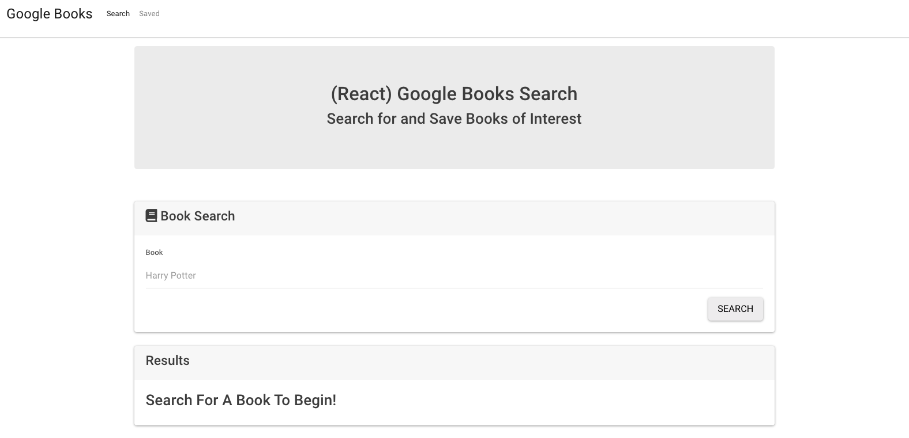

# Google-Books

 
  
## Description
  
Google Books integrated application. The main function for it is to keep a track of list of books the user wants to save.

The user has the ability to delete books from their list or search for a variety and add them to their list.

Working App Demo: [Application Video](https://drive.google.com/file/d/1vYNT02nYusa8Czt3I0XTV5sKzM_LXod_/view)


## Table of Contents
  
[Installation](#Installation)  
[Usage](#Usage)  
[License](#License)  
[Contributing](#Contributing)  
[Tests](#Tests)  
[Questions](#Questions)  
  
## Installation 

All dependencies located in the package.json on the root of the repo. Just run:
```  
npm install
```

This is how the homescreen would look:


## Usage
  
While developing, development version can be run by using:
```
npm start
```

You can also visit this link to visit the deployed version: [Site App](https://boiling-dawn-17766.herokuapp.com)
  
## License
  
Licensed under the [MIT license](LICENSE).
  
## Contributing
  
For any improvements, feel free to fork the code and submit a pull request.
  

## Questions

[GitHub Profile](https://github.com/omata48)  
For additional questions feel free to email me at omata48@outlook.com
    